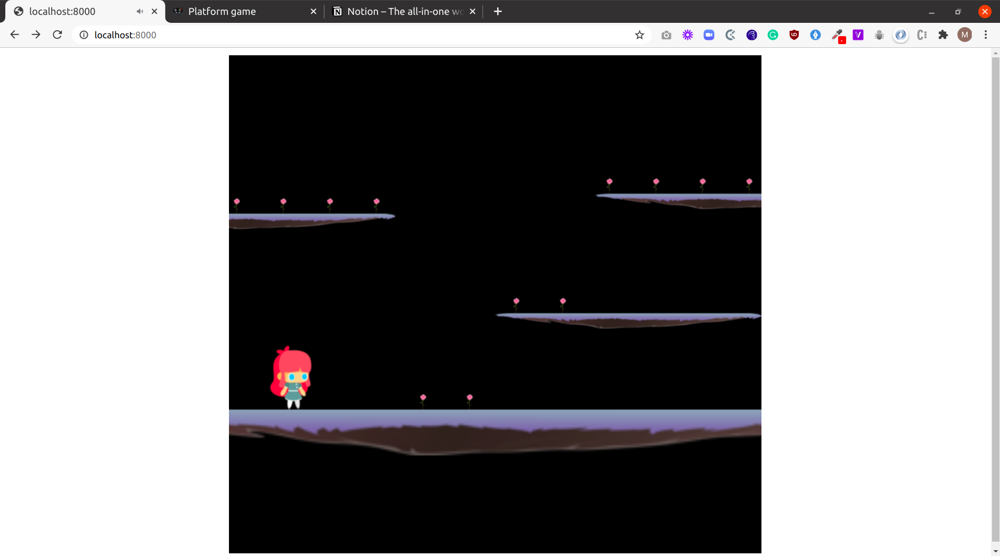

# gamer

## Project description
This project is an implementation of a game application which runs in the browser, using Phaser3 technology. Being new to Phaser, and game development, I built and modified upon this example in the [Phaser tutorial](http://phaser.io/tutorials/making-your-first-phaser-3-game/part1), as I much as I could while learning on the project.

This project is a capstone project at the end of the Microverse Javascript curriculum. The project's specifications are listed [here](https://www.notion.so/Platform-game-4a55a7d1fcc245bcb012c76814764712).

## Screenshot

## Built with
- HTML5
- [PHASER 3](https://phaser.io/phaser3)
- Javascript
- Webpack js framework
- Javascript design patterns
- Node JS

## Features
- This has a landing page, where users can access the app's features
- The player can 
    - move left, right and jump upwards in order to collect gems(flowers in this case).
    - double jump.
    - is disabled on collision with a grenade shell.
- The score is increased each time the player collects gem(s).
- A user can toggle between dark and light mode.
- A user can view the game in full screen mode and minimize screen.

## Deployed Site
[Gamer on heroku](https://super-gamer-app.herokuapp.com/)

## Running and testing it locally

### Prerequisites
- [NodeJS](https://nodejs.org/)
- [Yarn](https://yarnpkg.com/) or just the default npm which comes with NodeJS

### Setup
- Run `git clone https://github.com/bluette1/gamer && cd gamer` to get a copy of source codes on your local computer and to navigate inside the project directory
- Run `yarn install`
- Run `yarn build`

### Usage
- Run `yarn dev` to run this app in development environment or `yarn start` to run this project in production environment

### Tests
- yarn test

## Contributions

There are two ways of contributing to this project:

1.  If you see something wrong or not working, please check [the issue tracker section](https://github.com/bluette1/gamer/issues), if that problem you met is not in already opened issues then open a new issue by clicking on `new issue` button.

2.  If you have a solution to that, and you are willing to work on it, follow the below steps to contribute:
    1.  Fork this repository
    1.  Clone it on your local computer by running `git clone https://github.com/your-username/gamer.git` __Replace *your username* with the username you use on github__
    1.  Open the cloned repository which appears as a folder on your local computer with your favorite code editor
    1.  Create a separate branch off the *master branch*,
    1.  Write your codes which fix the issue you found
    1.  Commit and push the branch you created
    1.  Raise a pull request, comparing your new created branch with our original master branch [here](https://github.com/bluette1/gamer)

## Author

👤 **Marylene Sawyer**
- Github: [@Bluette1](https://github.com/Bluette1)
- Twitter: [@MaryleneSawyer](https://twitter.com/MaryleneSawyer)
- Linkedin: [Marylene Sawyer](https://www.linkedin.com/in/marylene-sawyer)

## Show your support

Give a ⭐️ if you like this project!

## Acknowledgment
- [Microverse](https://www.microvese.org)
- [Webpack](https://webpack.js.org/)
- [PHASER 3](https://phaser.io/phaser3)
- [Game Art 2d](https://www.gameart2d.com/cute-girl-free-sprites.html)
- [Icon Archive](https://iconarchive.com/)
- [UCraft](https://www.ucraft.com/)
- [PNGio.com](https://pngio.com/PNG/a108551-platform-game-png.html)
- [Free Icons Png](https://www.freeiconspng.com/downloadimg/34123)
- [PngTree](https://pngtree.com/)
- [Iconsdb.com](https://www.iconsdb.com/)
- [Web Icons PNG](https://webiconspng.com/)
- [Khinsider.com](https://downloads.khinsider.com/)
